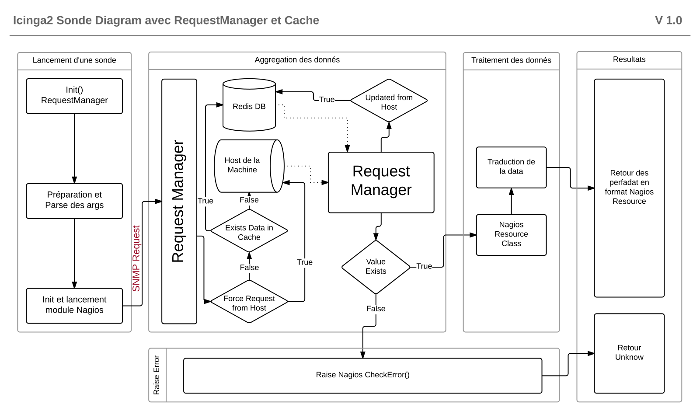

# Icinga2 Plugin RequetsManager avec Cache/Redis

Lib description

### Python Pip's utilisés:
***
* Redis (***Key** => **Val** DB stockage dans le RAM*)
* Hiredis (***C** Interface pour Redis*)
* EasySNMP (*Net-SNMP lib **Python** implementation en **Cython***)
* Nagiosplugin (*Nagios plugin lib pour **Python***)

### Pourqoi EasySNMP
***
**4 Python libs ont etés étudiés:**
* _**EasySNMP**_
* _**NetSNMP**_
* _**PySNMP**_
* _Unix SNMP lib native Unix commands avec os.popen comme **NativeSNMP**_

#### Benchmark Tests
Les tests realisés sur les mêmes OID utilisent SNMPWalk command.

Resultats en seconds (s):
 

| Fois appeller  | EasySNMP       | NetSNMP        | PySNMP         | NativeSNMP    |
| :------------- | :------------- | :------------- | :------------- |:------------- |
| 1 x            | 0.013871s      | **0.003734s**  | 0.516798s      | 0.005819s     |
| 10 x           | 0.020231s      | **0.016021s**  | 4.788551s      | 0.058144s     |
| 100 x          | **0.053363s**  | 0.180546s      | 53.863760s     | 0.616921s     |
| 1 000 x        | **0.381411s**  | 1.931081s      | 3255.206666s   | 6.720697s     |
| 10 000 x       | **3.930478s**  | 18.342071s     | N/A            | 156.051447s   |

| Temps moyens pour 1 req. | EasySNMP       | NetSNMP        | PySNMP         | NativeSNMP    |
| :-------------           | :------------- | :------------- | :------------- |:------------- |
| Fois Appelé x 1          | 0.013871s      | **0.003734s**  | 0.516798s      | 0.005819s     |
| Fois Appelé x 10         | 0.002023s      | **0.001602s**  | 0.478855s      | 0.005814s     |
| Fois Appelé x 100        | **0.000534s**  | 0.001806s      | 0.538638s      | 0.006169s     |
| Fois Appelé x 1 000      | **0.000381s**  | 0.001931s      | 3.255207s      | 0.006721s     |
| Fois Appelé x 10 000     | **0.000393s**  | 0.001834s      | N/A            | 0.015605s     |
| ------------------------ | -------------- | -------------- | -------------- | ------------- |
| Summary Moyen            | 0.003440s      | **0.002181s**  | 1.197375s      | 0.008026s     |

_EasySNMP manges very well big quantity of requests using single SNMP session._

### Diagrame Generale d'une sonde en utilisant RequestManager et Cache
***

#### Benchmark Tests using Icinga2 tasks load

Not done yet!!

# Icinga2 plugins

* check_disk_io (checking disk input/output)
* check_disk_load (checking machine load)
* check_linux_cpu (checking CPU on linux Machines)
* to be continued...

Copyright (c) 2016 Aurimas NAVICKAS All Rights Reserved.
